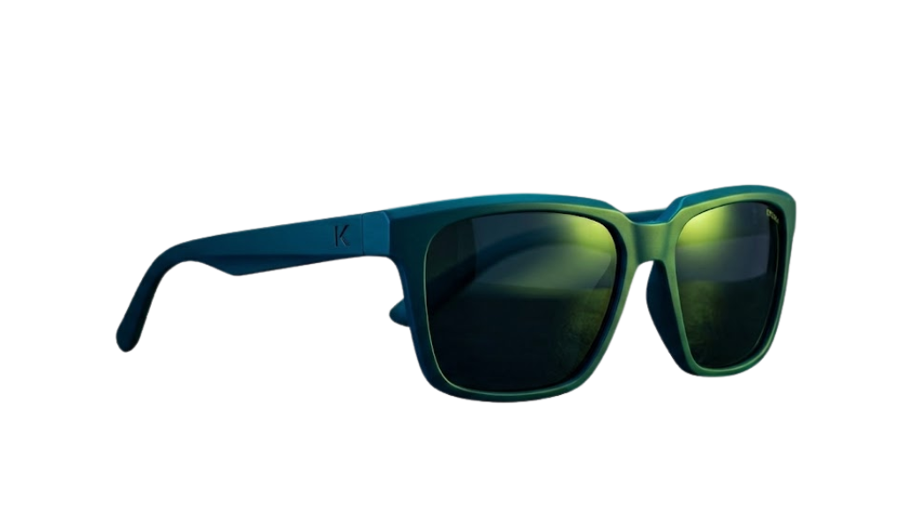

<div align="center">

# 🕶️ KROMA - K-01 "Apex" Landing Page

**High-contrast polarized sunglasses engineered for clarity, designed for impact.**

[](https://kroma-tau.vercel.app/)
[](https://react.dev/)
[](https://www.typescriptlang.org/)
[](https://vitejs.dev/)
[](https://tailwindcss.com/)



</div>

---

##  Table of Contents

- [Overview](#-overview)
- [Features](#-features)
- [Tech Stack](#-tech-stack)
- [Design Patterns](#-design-patterns)
- [Component Architecture](#-component-architecture)
- [Getting Started](#-getting-started)
- [Project Structure](#-project-structure)
- [Performance Optimizations](#-performance-optimizations)

---

##  Overview

KROMA is a premium product landing page showcasing the K-01 "Apex" sunglasses collection. This project demonstrates modern frontend development practices with a focus on animations, performance, and user experience. The landing page features a full-screen hero section with minimal design, progressive content reveal on scroll, and smooth micro-interactions.

**Key Highlights:**
-  Minimalist, high-impact design with neon accent colors
-  Advanced animations using Framer Motion
-  Fully responsive across all devices
-  Optimized performance with lazy loading
-  Component-based architecture following React best practices

---

##  Features

###  UI/UX
- **Full-Screen Hero Section** - Immersive landing experience with centered content
- **Animated Text Gradients** - Eye-catching gradient text effects with glow
- **Scroll-Based Content Reveal** - Progressive disclosure pattern for content sections
- **Hover Interactions** - Subtle micro-animations on product images
- **Glass-morphism Effects** - Modern backdrop blur and transparency
- **Responsive Grid System** - Adaptive layouts for all screen sizes

###  Animations
- Framer Motion orchestration with staggered children
- Blur-to-focus fade-in animations
- Scale and rotation transforms on hover
- Smooth scroll-triggered reveals
- Custom easing functions for premium feel

###  Visual Design
- Dark mode optimized color scheme
- Neon lime (#C0FF00) accent color
- Custom gradient backgrounds
- Animated glow effects
- High-contrast typography

---

##  Tech Stack

### Core Technologies
| Technology | Purpose | Version |
|------------|---------|---------|
|  | UI Library | 18.3.1 |
|  | Type Safety | 5.5.3 |
|  | Build Tool | 5.4.2 |

### Styling & UI
| Library | Purpose |
|---------|---------|
|  | Utility-first CSS framework |
|  | Animation library for React |

### Icons & Graphics
| Library | Purpose |
|---------|---------|
| `lucide-react` | Modern icon library with React components |

### Development Tools
- **ESLint** - Code quality and consistency
- **PostCSS** - CSS processing with Autoprefixer
- **Vercel** - Deployment and hosting platform

---

##  Design Patterns

### 1. **Component Composition Pattern**
Components are built using composition over inheritance, making them highly reusable and testable.

```tsx
<HeroSection />
  ├── <motion.h1> (Headline)
  └── <motion.div> (Product Image)
      └── <TechSpecsBox>
```

### 2. **Container/Presentational Pattern**
Separation of concerns between layout containers and presentational components:
- **Layout Components**: `BackgroundEffects`, `NavBar`, `Footer`
- **Section Components**: `HeroSection`, `ContentSection`, `FeaturesSection`
- **UI Components**: `FeatureBlock`, `TechSpecsCard`, `SocialProof`

### 3. **Animation Orchestration Pattern**
Centralized animation variants for consistency:

```tsx
// constants/animations.ts
export const containerVariants = {
  hidden: { opacity: 0 },
  visible: { opacity: 1, transition: { staggerChildren: 0.15 } }
};

export const itemVariants = {
  hidden: { opacity: 0, y: 40, filter: "blur(10px)" },
  visible: { opacity: 1, y: 0, filter: "blur(0px)" }
};
```

### 4. **Responsive Design Pattern**
Mobile-first approach with Tailwind's responsive utilities:
- Base styles for mobile
- `sm:` for tablets (640px+)
- `md:` for medium screens (768px+)
- `lg:` for desktops (1024px+)
- `xl:` for large screens (1280px+)

### 5. **Progressive Enhancement**
- Core content visible without JavaScript
- Enhanced with animations when JS is available
- Scroll-triggered animations using `whileInView`

---

##  Component Architecture

### Layout Components
```
components/layout/
├── BackgroundEffects.tsx    # Animated gradient background
├── NavBar.tsx               # Navigation header with mobile menu
└── Footer.tsx               # Site footer with links
```

### Section Components
```
components/sections/
├── HeroSection.tsx          # Full-screen hero with product image
├── ContentSection.tsx       # Product details and CTAs
├── FeaturesSection.tsx      # Feature highlights grid
└── PreOrderBanner.tsx       # Call-to-action banner
```

### UI Components
```
components/ui/
├── FeatureBlock.tsx         # Individual feature card
├── TechSpecsCard.tsx        # Floating tech specs display
├── SocialProof.tsx          # Trust indicators
└── MobileMenu.tsx           # Mobile navigation drawer
```

### State Management
This project uses **React's built-in state management**:
- `useState` for local component state (mobile menu toggle)
- `Props drilling` for parent-child communication
- **No external state management** - lightweight architecture suitable for landing pages

### Animation Strategy
**Framer Motion** provides declarative animations:
- `motion` components wrap standard HTML elements
- `variants` define animation states
- `initial` / `animate` / `whileInView` control animation triggers
- `transition` customizes timing and easing

---

##  Getting Started

### Prerequisites
- **Node.js** 18+ and npm/yarn/pnpm

### Installation

```bash
# Clone the repository
git clone <repository-url>

# Navigate to project directory
cd kroma-sunglasses

# Install dependencies
npm install
# or
yarn install
# or
pnpm install
```

### Development

```bash
# Start development server
npm run dev

# Open in browser
# http://localhost:5173
```

### Build for Production

```bash
# Create optimized production build
npm run build

# Preview production build
npm run preview
```

### Linting

```bash
# Run ESLint
npm run lint
```

---

##  Project Structure

```
kroma-sunglasses/
├── public/                      # Static assets
├── src/
│   ├── assets/                  # Images and media
│   │   └── Kroma-sunglasses.png
│   ├── components/
│   │   ├── layout/              # Layout components
│   │   │   ├── BackgroundEffects.tsx
│   │   │   ├── NavBar.tsx
│   │   │   └── Footer.tsx
│   │   ├── sections/            # Page sections
│   │   │   ├── HeroSection.tsx
│   │   │   ├── ContentSection.tsx
│   │   │   ├── FeaturesSection.tsx
│   │   │   └── PreOrderBanner.tsx
│   │   └── ui/                  # Reusable UI components
│   │       ├── FeatureBlock.tsx
│   │       ├── TechSpecsCard.tsx
│   │       ├── SocialProof.tsx
│   │       └── MobileMenu.tsx
│   ├── constants/               # Configuration
│   │   └── animations.ts        # Animation variants
│   ├── styles/
│   │   └── global.css          # Global styles
│   ├── App.tsx                 # Main app component
│   ├── main.tsx               # Application entry point
│   └── index.css              # Tailwind imports
├── index.html
├── package.json
├── tailwind.config.js         # Tailwind configuration
├── tsconfig.json             # TypeScript configuration
└── vite.config.ts           # Vite configuration
```

---

##  Performance Optimizations

### 1. **Build Optimizations**
- **Vite's Fast HMR** - Instant hot module replacement during development
- **Code Splitting** - Automatic chunking for optimal bundle sizes
- **Tree Shaking** - Eliminates unused code from production bundles

### 2. **Image Optimization**
- PNG images with optimized compression
- Proper sizing for responsive layouts
- CSS `object-contain` for aspect ratio preservation

### 3. **Animation Performance**
- **GPU-accelerated transforms** - Using `transform` and `opacity`
- **Will-change hints** - Optimizing animation layers
- **RequestAnimationFrame** - Framer Motion's efficient animation loop

### 4. **CSS Optimization**
- **Tailwind CSS Purging** - Removes unused styles in production
- **PostCSS Processing** - Autoprefixer and minification
- **Critical CSS** - Inline styles for above-the-fold content

### 5. **React Optimizations**
- Functional components with hooks
- Minimal re-renders with proper component structure
- No unnecessary prop drilling

---

##  Design Philosophy

### Color Palette
```css
Primary Background: #0F1F24  /* Deep teal-black */
Text Primary:       #F0F0E8  /* Off-white */
Accent:            #C0FF00   /* Neon lime */
Accent Secondary:  #84cc16   /* Lime-600 */
Border:            #1E3A47   /* Dark teal */
```

### Typography
- **Headings**: Syne (Bold, Extrabold) - Modern geometric sans
- **Body**: Space Grotesk - Technical, contemporary feel
- **Monospace**: System mono - For technical specs

### Spacing Scale
Following Tailwind's default spacing scale (4px base unit):
- `gap-4` (16px) - Tight spacing
- `gap-6` (24px) - Medium spacing
- `gap-12` (48px) - Large spacing
- `py-32` (128px) - Section padding

---

##  Future Enhancements

- [ ] Add product gallery with Lightbox
- [ ] Integrate e-commerce functionality
- [ ] Implement product customization options
- [ ] Add 3D product viewer
- [ ] Multi-language support (i18n)
- [ ] Dark/Light mode toggle
- [ ] Newsletter subscription integration
- [ ] Analytics and tracking

---

##  License

This project is a concept design for portfolio purposes.

---

##  Contributing

This is a portfolio project. If you'd like to suggest improvements, feel free to open an issue or submit a pull request.

---

<div align="center">

**Built with ❤️ using React, TypeScript, and Framer Motion**

[🌐 Live Demo](https://kroma-tau.vercel.app/) • [📧 Contact](mailto:your-email@example.com)

</div>
